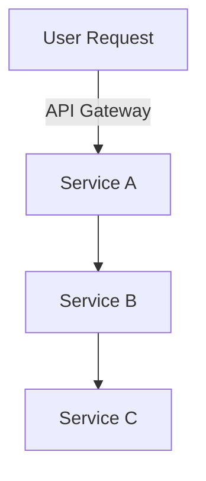

# Architecture Notes

The system is structured in a modular service architecture with distinct layers to separate concerns and optimize scalability. Each module is responsible for a specific domain or function, making the architecture flexible for updates and enhancements.

---

## System Architecture Overview

The application follows a microservices architecture, allowing for independent deployment of services. This enhances maintainability and scalability. Requests are routed through a central API gateway, which then dispatches them to the appropriate service. Each service processes the request within its bounded context, ensuring separation of concerns and reducing dependencies.

---

## Architectural Layers

- **Services**: Core business logic (`apps/api/src/services/`)
- **Generators**: Content generation (`packages/pdf-generator/src/generators/`)
- **Repositories**: Data access layer (`packages/database/src/`)
- **Controllers**: Request handling and response formatting (`apps/api/src/controllers/`)
- **Utils**: Shared utilities and helper functions (`packages/shared/src/utils/`)
- **Models**: Database schemas and ORM-related files (`packages/database/src/schema`)
- **Components**: UI components for the web application (`apps/web/components/`)

> See [`codebase-map.json`](./codebase-map.json) for complete symbol counts and dependency graphs.

---

## Detected Design Patterns

| Pattern   | Confidence | Locations                                  | Description                         |
|-----------|------------|--------------------------------------------|-------------------------------------|
| Factory   | 85%        | `packages/nfse-client/src/factory.ts`      | Creates instances of different clients |
| Observer  | 70%        | `apps/api/src/modules/events/`             | Implements event-based notification system |
| Singleton | 90%        | `apps/api/src/config/database.ts`          | Manages a single database connection instance |

---

## Entry Points

- [`apps/api/src/index.ts`](../apps/api/src/index.ts)
- [`apps/web/src/index.tsx`](../apps/web/src/index.tsx)
- [`packages/nfse-client/src/index.ts`](../packages/nfse-client/src/index.ts)

---

## Public API

| Symbol                 | Type      | Location                                          |
|------------------------|-----------|---------------------------------------------------|
| `AbrasfClient`         | Class     | `packages/nfse-client/src/abrasf/client.ts:25`    |
| `addCertificateCheckerJob` | Function | `apps/api/src/jobs/queues.ts:165`                |
| `AlertasService`       | Service   | `apps/api/src/modules/alertas/service.ts:19`      |

---

## Internal System Boundaries

In our architecture, internal system boundaries are established to delineate responsibilities and facilitate microservice communication. Services are self-contained and interact through well-defined APIs. Data synchronization is managed through event-driven mechanisms, ensuring consistent state across services.

---

## External Service Dependencies

- **SaaS Platform XYZ**: Used for notifications; OAuth2 for authentication.
- **Third-party API ABC**: Integrates financial data; rate limited to 1000 requests/day.
- **Infrastructure Service DEF**: Hosting and deployment; manages load balancing and uptime.

---

## Key Decisions & Trade-offs

The choice to implement a microservices architecture allows independent scaling but also introduces complexity in service communication and monitoring. The decision was driven by the need for flexibility and resilience. The trade-off is managing distributed data consistency and increased operational overhead.

---

## Diagrams

---

## Risks & Constraints

Performance can be constrained by the latency in inter-service communication. Strategies for risk mitigation include caching responses and optimizing network calls. Asynchronous processes handle heavy workloads, reducing the impact on real-time services.

---

## Top Directories Snapshot

- **`apps/`**: 250 files
- **`packages/`**: 400 files
- **`configs/`**: 30 files

---

## Related Resources

- [Project Overview](./project-overview.md)
- [Data Flow Documentation](./data-flow.md)
- [Codebase Map](./codebase-map.json)
