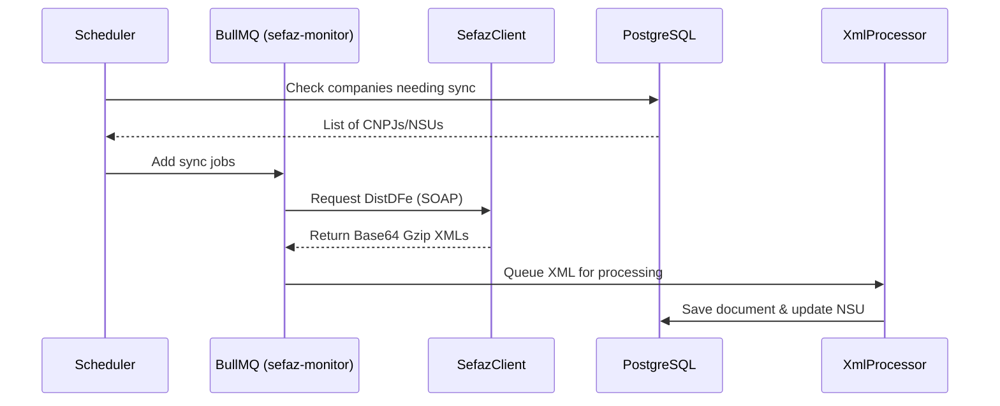

# Architecture Documentation

This document describes the system architecture of FiscalZen, a multi-tenant platform for fiscal document management (NFe, CTe, MDFe, NFSe).

## System Overview

FiscalZen is built as a **modular monorepo** using Turborepo. It manages the lifecycle of fiscal documents: from monitoring and downloading from SEFAZ/Prefeituras to processing, indexing, and manifesting.

### Tech Stack
- **Backend**: Node.js with Fastify (TypeScript)
- **Frontend**: Next.js 14 (App Router)
- **Database**: PostgreSQL with Drizzle ORM
- **Queue/Background Jobs**: Redis with BullMQ
- **Search Engine**: Meilisearch
- **Storage**: MinIO or AWS S3 compatible storage

---

## Workspace Structure

The repository is organized into `apps` and `packages`:

| Directory | Purpose |
| :--- | :--- |
| `apps/api` | Fastify REST API and background workers. |
| `apps/web` | Next.js frontend application. |
| `packages/database` | Schema definitions (Drizzle) and database client. |
| `packages/sefaz-client` | SOAP client for SEFAZ integrations (DistDFe, Manifestação). |
| `packages/nfse-client` | Integration with various municipal NFSe providers (ABRASF and RPA). |
| `packages/xml-parser` | High-performance XML parsing and document type detection. |
| `packages/shared` | Shared types, constants, and validation logic. |
| `packages/ui` | Shared UI components (Shadcn/UI). |

---

## Architectural Layers

### 1. Data Layer (`packages/database`)
The database uses a multi-tenant design where almost every table contains a `tenant_id`. 
- **Multi-tenancy**: Isolation is enforced at the query level.
- **Key Tables**: 
    - `tenants`: Root organization.
    - `companies`: Entities belonging to a tenant (holds CNPJ and certificates).
    - `documents`: Stored NFe, CTe, MDFe records.
    - `nsu_control`: Tracks the last downloaded NSU (Numero Sequencial Único) per company.

### 2. Integration Layer (`packages/sefaz-client` & `packages/nfse-client`)
Handles communication with external government web services.
- **Security**: Handles A1 certificates, XML signing (`signXml`), and SOAP envelopes.
- **Resilience**: Implements specialized error classes (`SefazError`, `TimeoutError`) and retry patterns.

### 3. Background Jobs (`apps/api/src/jobs`)
Background processing is handled by BullMQ to ensure the API remains responsive during heavy XML processing.

- **`sefaz-monitor`**: Periodically checks for new documents via `DistDFe`.
- **`xml-processor`**: Takes raw XML, parses data using `packages/xml-parser`, and saves to DB.
- **`search-sync`**: Indexes processed documents into Meilisearch for fast filtering.
- **`nfse-monitor`**: Scrapes or queries municipal portals for service invoices.

---

## Data Flow: Document Acquisition



---

## Security Architecture

### Authentication
- **JWT-based**: The API uses `@fastify/jwt`.
- **Claims**: Tokens include `userId` and `tenantId`.
- **Middleware**: The `authenticate` decorator ensures routes are protected and sets `request.user`.

### Certificate Handling
A1 Certificates (PFX) are sensitive.
1. **Upload**: Certificates are encrypted using AES-256-GCM before storage.
2. **Key Management**: Encryption keys are managed via the `CERT_ENCRYPTION_KEY` environment variable.
3. **Usage**: Certificates are decrypted in-memory only when initiating a SOAP request to SEFAZ/Prefeitura.

### Search and Indexing
Meilisearch provides the search capabilities. The indexing process is decoupled:
1. `documentsService` saves to Postgres.
2. An event triggers the `search-sync` job.
3. `batchIndexDocuments` updates the Meilisearch index.
4. Frontend queries Meilisearch via the API for high-performance filtering.

---

## Core Components Reference

### XML Detection & Parsing
The `packages/xml-parser` package is the brain of document ingestion:
- **`detectDocumentType`**: Analyzes XML tags to distinguish between NFe, CTe, MDFe, or Events.
- **`decodeDocZip`**: Handles the Gzip decompression of SEFAZ responses.
- **`auto.ts`**: Provides a unified interface to parse any supported Brazilian fiscal document.

### API Response Standard
All API responses follow a consistent structure defined in `apps/api/src/utils/response.ts`:
```typescript
{
  success: boolean;
  data?: T;
  error?: {
    code: string;
    message: string;
    details?: any;
  };
  meta?: PaginationMeta;
}
```

---

## Deployment & Scaling
- **Stateless API**: `apps/api` can be scaled horizontally.
- **Worker Isolation**: Workers can be deployed on separate nodes from the API by filtering which BullMQ queues they process.
- **Storage**: XML files are stored in S3/MinIO to keep the database size manageable.
