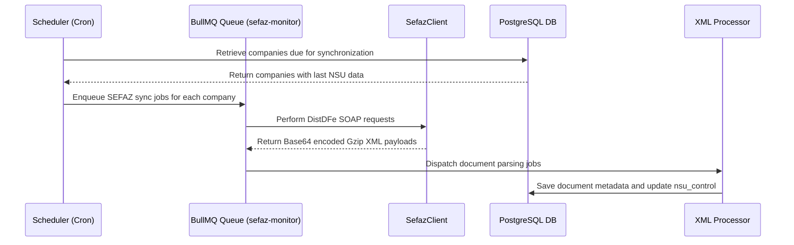

# FiscalZen Architecture Documentation

This document provides a comprehensive overview of the architecture of **FiscalZen**, a modular multi-tenant platform designed to facilitate the management, monitoring, and processing of Brazilian fiscal documents such as NFe, CTe, MDFe, and NFSe.

---

## System Overview

FiscalZen automates the entire lifecycle of fiscal documents, including retrieval from governmental services, parsing, storage, manifestation (event handling), and query-based retrieval. Built as a modular monorepo using Turborepo, it emphasizes modularity and code reuse.

### Technology Stack

- **Backend:** Node.js with Fastify (TypeScript)
- **Frontend:** Next.js 14 with App Router
- **Database:** PostgreSQL accessed via Drizzle ORM
- **Job Queue:** Redis with BullMQ for background processing
- **Search Engine:** Meilisearch for fast, faceted document filtering
- **File Storage:** MinIO or AWS S3 compatible object storage for XML documents

---

## Repository Structure

| Directory                      | Responsibility                                                                                  |
|-------------------------------|------------------------------------------------------------------------------------------------|
| `apps/api`                    | Fastify REST API and background job workers                                                   |
| `apps/web`                    | Next.js frontend dashboard and UI components                                                  |
| `packages/database`           | Database schema definitions, migrations, and client abstraction                              |
| `packages/sefaz-client`       | SEFAZ SOAP client infrastructure and digital signature management                             |
| `packages/nfse-client`        | Municipal fiscal services integration via ABRASF SOAP and RPA scrapers                       |
| `packages/xml-parser`         | XML parsing, Gzip decoding, and document type detection utilities                            |
| `packages/shared`             | Shared TypeScript types, Zod schemas, constants, validation, and formatting utilities        |
| `packages/ui`                 | Shared UI components built with Shadcn/UI and Tailwind CSS                                  |

---

## Architectural Layers

### 1. Data Layer (`packages/database`)

- **Multi-tenancy:** Data partitioned by `tenant_id` to enforce data isolation.
- **Key entities:**
  - `tenants`: Top organizational units.
  - `companies`: Legal entities holding tax IDs (CNPJs) and certificates.
  - `documents`: Metadata and extracted data of fiscal documents (NFe, CTe, MDFe).
  - `nsu_control`: Tracks the last synchronized SEFAZ NSU for continuous document sync.

### 2. Integration Layer (`packages/sefaz-client` & `packages/nfse-client`)

- **SEFAZ SOAP Client:** Sends signed SOAP requests using A1 digital certificates to government web services.
- **Error Handling:** Dedicated classes like `SefazError`, `CertificadoError`, and `TimeoutError` provide granular failure diagnosis.
- **NFSe Integration:** Uses a Factory pattern to select between ABRASF SOAP-based clients or RPA scrapers for municipalities lacking modern APIs.

### 3. Background Processing (`apps/api/src/jobs`)

- Leveraging **BullMQ** queues for asynchronous, scalable processing of tasks.
- **Major jobs:**
  - `sefaz-monitor`: Polls SEFAZ’s `nfeDistDFeInteresse` for new documents.
  - `xml-processor`: Handles decoding and parsing of Gzip XML payloads and updates the database.
  - `search-sync`: Indexes document metadata in Meilisearch for performant filtering.
  - `nfse-monitor`: Supervises sync of municipal fiscal documents with municipality-specific protocols.

---

## Document Processing Data Flow

---

## Security Architecture

### Authentication & Authorization

- JWT tokens via Fastify’s `@fastify/jwt` plugin encode `userId` and `tenantId`.
- API access scoped by `tenantId` for strict data isolation.
- Service layers require explicit `tenantId` parameters.

### Certificate Management

- A1 digital certificates are encrypted in the database using AES-256-GCM with secure keys stored in environment variables.
- Certificates are decrypted only in memory during SOAP requests.
- No certificate data is ever persisted or logged in clear text.

---

## Core Components

### XML Parsing and Detection (`packages/xml-parser`)

- Detects document type via XML root tag and schema analysis.
- Supports multiple fiscal document formats: NFe, CTe, MDFe, and manifest events.
- Unified parser abstraction (`parsers/auto.ts`) outputs normalized typed structures.
- Handles SEFAZ's base64-encoded Gzip payloads transparently.

### Search and Filtering

- PostgreSQL is the canonical source for document metadata.
- Meilisearch provides fast faceted filtering on documents for end-users.
- A synchronization job keeps Meilisearch in sync with PostgreSQL data.
- Supports rich filtering on recipient names, document items, and attributes.

---

## Deployment and Scaling

- **Frontend/API:** Stateless Fastify and Next.js apps scale horizontally behind load balancers.
- **Workers:** Independently scalable background workers process ingestion and indexing workloads.
- **Database:** PostgreSQL stores all structured relational data.
- **Search Engine:** Meilisearch is scaled based on load.
- **Storage:** XML files are stored externally in MinIO or AWS S3-compatible storage systems to ensure optimal backup and size management.

---

## Developer Tips & Notes

- The monorepo modular architecture allows isolated development and testing of packages reused across multiple apps.
- Always pass correct `tenantId` to APIs and services to maintain data isolation.
- Certificate handling and cryptographic operations require extra caution to maintain security.
- The BullMQ job queue offloads long-running tasks to prevent API blocking.
- To explore document type handling, start with `packages/xml-parser/src/parsers/auto.ts`.
- For municipal NFSe support, extend functionality via the factory and adapter pattern in `packages/nfse-client/src`.
- Prefer using existing background job processors (`apps/api/src/jobs/`) for batch document operations rather than synchronous calls.

---

This document serves as a foundational guide for understanding FiscalZen’s design decisions, core architecture, and principal workflows. For more detailed information, explore the respective `app` and `package` directories.
