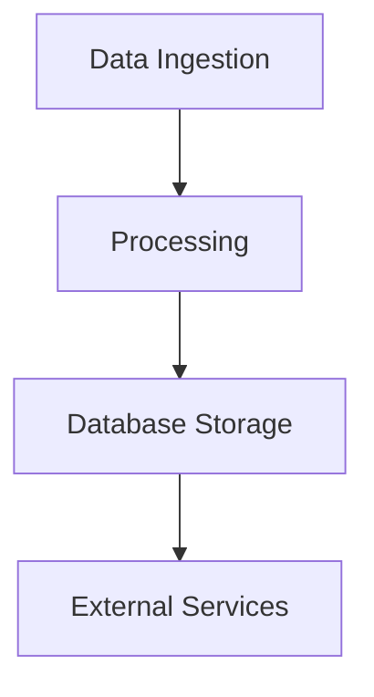

# Data Flow & Integrations

This document provides a detailed explanation of how data moves through the system, including interactions with external services. This insight is crucial for architects seeking to understand the overall architecture and data handling in the system.

## Data Flow & Integrations

Data in the system follows a precise path from ingestion to eventual egress. Various modules handle the transformation, validation, and storage of data before any necessary outbound communication with external services.

1. **Data Entry**: Data enters the system through API endpoints exposed by the web and mobile interfaces. The entry points typically enforce initial validation and security protocols.

2. **Processing and Transformation**: Once data is ingested, it proceeds through a series of transformations. Intermediate processing stages involve checks, enhancements, and preparation for storage.

3. **Data Persistence**: Processed data is stored in the system's underlying database, ensuring all necessary fields and structures are maintained.

4. **Outbound Communication**: Based on triggers and conditions, data may exit the system to interact with external services. This phase includes communication with Sefaz systems for fiscal document processing or integration with other third-party services using webhooks.

## Module Dependencies

The system's modular architecture enables precise functionality encapsulated within separate modules. Here are the notable dependencies:

- **src/** → `utils`, `config`
- **services/** → `utils`
- **controllers/** → `services`, `utils`
- **repositories/** → `models`

## Service Layer

The service layer is the backbone handling business logic and processing flows. Below are the primary service classes with links to their implementations:

- **[WebhookService](../apps/api/src/modules/webhooks/service.ts)**
- **[TagsService](../apps/api/src/modules/tags/service.ts)**
- **[RelationsService](../apps/api/src/modules/relations/service.ts)**
- **[DashboardService](../apps/api/src/modules/dashboard/service.ts)**
- **[CompaniesService](../apps/api/src/modules/companies/service.ts)**

## High-level Flow

The system's architecture supports a streamlined pipeline from data ingestion to output. 

- **Input**: Data is collected through well-defined API endpoints. Input undergoes initial validation checks.
- **Processing**: Subsequent stages focus on transforming and enhancing data within queues and processing jobs.
- **Storage**: Post-processing, data is committed to the system's storage layer, maintaining integrity and accessibility.
- **Output**: Transition from storage to external service calls is handled by specific modules which manage Sefaz interactions or other third-party services.

## Internal Movement

Modules within the system communicate predominantly through events and queues:

- **Message Queues**: Enable asynchronous processing of data, decoupling ingestion from processing.
- **Events**: Propagate changes and updates across modules efficiently.
- **Database**: Acts as a central point of truth and coordination between modules.

## External Integrations

The system interfaces with several external services:

- **Sefaz Systems**: For fiscal document validation and processing.
  - **Authentication**: Utilizes certificates for secure communication.
  - **Payloads**: XML formatted requests and responses adhering to governmental specifications.
  - **Retries**: Implemented using exponential backoff strategies on failure.
  
- **Webhooks**: Allow integration with third-party services for automated notifications.

## Observability & Failure Modes

Robust monitoring mechanisms ensure system reliability and fault tolerance:

- **Metrics and Logs**: Provide real-time visibility into API usage, processing times, and error rates.
- **Failure Handling**: Implements dead-letter queues and compensating transactions to handle failures gracefully.
- **Alerting**: Set up to notify operations teams about anomalies or system failures promptly.

## Related Resources

- [Architecture Overview](./architecture.md)
