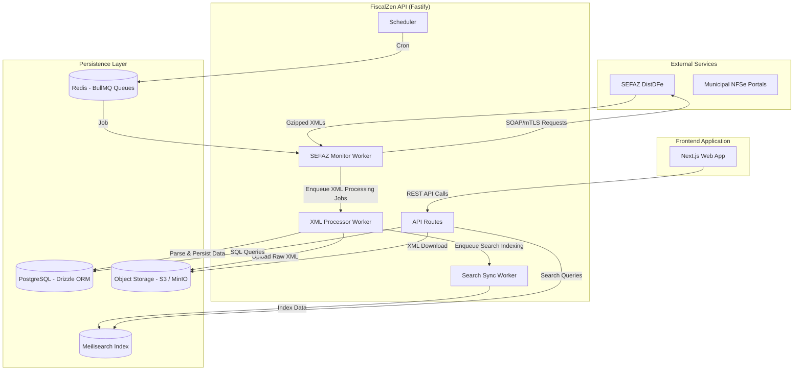

# FiscalZen Data Flow and Integrations

This document provides a comprehensive overview of the data flow, architecture, processing pipelines, and storage strategies in the FiscalZen system. It is intended to help developers understand how fiscal documents are handled end-to-end—from government services ingestion to frontend presentation.

---

## Architecture Overview

FiscalZen is designed as a distributed, modular system focused on scalability, reliability, and high availability. It bridges external government services with a fast, searchable user interface.



---

## Ingestion Pipelines

### 1. SEFAZ Document Distribution Sync (NFe, CTe, MDFe)

FiscalZen synchronizes fiscal documents issued to/by companies via the SEFAZ National Distribution Web Service (DistDFe).

- **Job Scheduling**  
  A scheduler (`apps/api/src/jobs/scheduler.ts`) enqueues sync tasks periodically based on NSU (Sequential Number) tracking in the `nsu_control` table.

- **Secure Communication**  
  Uses `SefazClient` (`packages/sefaz-client`) to establish mutual TLS (mTLS) connections authenticated via company-specific A1 certificates.

- **Document Retrieval and Polling**  
  The `sefaz-monitor` worker requests documents in batches by NSU numbers until the latest available document is reached.

- **Error Handling and Rate Limits**  
  Specifically handles SEFAZ error code 656 to implement exponential backoff retry mechanisms within BullMQ queues to ensure stable consumption and avoid lockouts.

### 2. Municipal NFSe Sync

FiscalZen supports two approaches depending on municipal infrastructure:

- **ABRASF SOAP Web Services**  
  For municipalities implementing ABRASF SOAP standards, the system uses `AbrasfClient` (`packages/nfse-client`), which abstracts the communication.

- **RPA-Based Scraping**  
  For municipalities without APIs, a headless browser-driven scraper (`BrowserManager` in `packages/nfse-client/src/rpa/browser.ts`), built on Playwright, simulates user interaction to download invoice XMLs and PDFs.

---

## Processing and Persistence Pipeline

### XML Processing

- **Decoding**  
  Documents might be Base64-encoded and gzip-compressed. Utilities like `decodeDocZip` from `packages/xml-parser/src/gzip.ts` handle decoding.

- **Document Type Detection**  
  The system identifies the XML schema (NFe, CTe, NFSe, event types, etc.) via `detectDocumentType` in the `xml-parser` package, enabling appropriate parsing.

- **Parsing**  
  Converts XML documents to strongly typed JSON objects using `@fiscalzen/xml-parser`, allowing further programmatic manipulation.

- **Database Storage**  
  - Core document data is persisted in PostgreSQL (`documents` table).  
  - Associated events like cancellations or manifestations are stored in `document_events`, linked to parent documents.

- **Raw XML Archival**  
  Original XML files are uploaded to immutable Object Storage (S3 or MinIO), stored in a structured folder hierarchy:  
  ```
  {tenantId}/{year}/{month}/{chave}.xml
  ```

### Search Indexing

- The search sync worker fetches data from PostgreSQL, flattens nested XML structures into searchable fields (e.g., issuer CNPJ, document status).
- It pushes the processed payload to Meilisearch indexes partitioned by tenant, enabling fast, secure multi-tenant search on the frontend.

---

## External Communication & Core Libraries

| Functionality          | Protocol / Technology      | Core Library / Package            |
|-----------------------|---------------------------|----------------------------------|
| SEFAZ SOAP Client     | SOAP 1.2, XML-DSIG        | `packages/sefaz-client`           |
| NFSe ABRASF Client    | SOAP Web Service          | `packages/nfse-client` (`abrasf`)|
| NFSe Scraper          | Headless Browser Automation (Playwright) | `packages/nfse-client/src/rpa/browser.ts` |
| Certificate Handling  | PKCS#12 (PFX)             | `node-forge` (used internally)   |
| Job Management        | Job Queues with Retries   | BullMQ (Redis-backed)             |

---

## Data Consistency & Reliability Mechanisms

- **Atomic Transactions**  
  NSU updates and document insertions within PostgreSQL are performed atomically. Failure to upload raw XML to S3 triggers transactional rollbacks to prevent inconsistent states.

- **Idempotency and Deduplication**  
  Documents are keyed by their unique access key (`chave`). Before inserting, the processor checks for existing entries to avoid duplicates due to overlapping syncs.

- **Schema Versioning & Adaptability**  
  The XML parser identifies and supports multiple SEFAZ schema versions (e.g., v3.10, v4.00), enabling backward compatibility and smooth enhancements.

---

## Storage Components Overview

| Storage Layer               | Purpose                                                       |
|-----------------------------|---------------------------------------------------------------|
| **PostgreSQL (via Drizzle ORM)** | Persistent storage of parsed fiscal documents and events     |
| **Redis (BullMQ)**            | Job queue state, retry handling, ephemeral caches (e.g., decrypted certs) |
| **S3 / MinIO Object Store**   | Immutable archival of original XML documents (retention mandated 5 years) |
| **Meilisearch**               | Fast, tenant-isolated full-text search indexes for frontend queries |

---

## Usage Examples

### SEFAZ NSU Sync and Processing

- The `sefaz-monitor` worker fetches documents from SEFAZ using a secure SOAP client.
- Retrieved zipped XMLs are enqueued for processing by the `xml-processor` worker.
- Processed documents are saved in PostgreSQL and the raw XMLs are uploaded to S3/MinIO.
- Finally, the `search-sync` worker indexes documents into Meilisearch for frontend querying.

### Municipal NFSe Synchronization

- Municipality support is detected and chosen dynamically.
- For ABRASF-compatible municipalities, `AbrasfClient` is used.
- For others, a Playwright-based `BrowserManager` scraper automates downloads.

### Frontend Search

- The Next.js frontend queries REST API endpoints.
- API translates queries to PostgreSQL for metadata and to Meilisearch for text search.
- XML files are downloaded securely from S3 when requested by users.

---

## Key Modules and Files Reference

| Functionality                | Key Files / Modules                                              |
|-----------------------------|-----------------------------------------------------------------|
| Job Scheduling              | `apps/api/src/jobs/scheduler.ts`                                |
| SEFAZ Monitor Worker        | `apps/api/src/jobs/sefaz-monitor.ts`                            |
| XML Processing Worker       | `apps/api/src/jobs/xml-processor.ts`                            |
| Search Sync Worker          | `apps/api/src/jobs/search-sync.ts`                              |
| SEFAZ SOAP Client           | `packages/sefaz-client/src/client.ts`                           |
| SEFAZ SOAP Utilities        | `packages/sefaz-client/src/soap-client.ts`                      |
| NFSe ABRASF Client          | `packages/nfse-client/src/abrasf/client.ts`                     |
| NFSe RPA Scraper            | `packages/nfse-client/src/rpa/browser.ts`                       |
| XML Detection & Parsing     | `packages/xml-parser/src/detector.ts`, `packages/xml-parser/src/utils.ts` |
| API Routes and Frontend     | `apps/web/components`, `apps/web/lib/api.ts`                    |

---

## Summary

FiscalZen implements a robust, scalable, and maintainable data flow layered as follows:

- **External Sync**  
  Polling and retrieving official fiscal documents via secure SOAP or web scraping.

- **Processing Pipeline**  
  Streamlined decompression, detection, parsing, validation, and storage of fiscal documents with transactional integrity.

- **Storage & Indexing**  
  Combination of relational DB storage, immutable archival on Object Storage, and fast, tenant-specific search indexes.

- **Scalable Worker-Based Architecture**  
  Leveraging BullMQ for asynchronous processing, backoff strategies, and reliability.

This architecture empowers FiscalZen to safely process large volumes of fiscal data, ensure compliance with retention requirements, and deliver rapid search capabilities to users.
