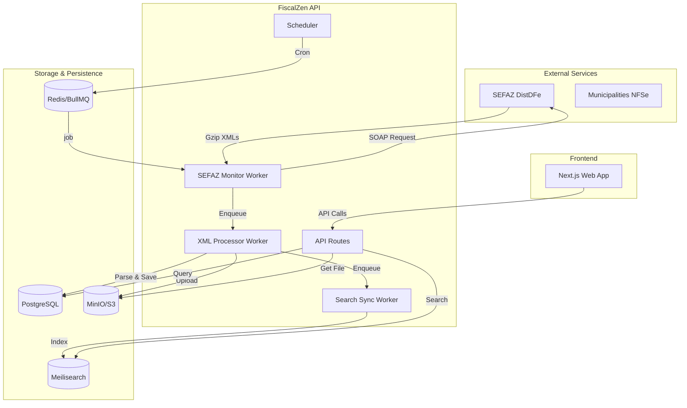

# Data Flow & Integrations

This document describes how data enters, flows through, and exits the FiscalZen system. It covers the lifecycle of fiscal documents from external discovery to storage and search indexing.

## High-Level Architecture

---

## Core Data Flows

### 1. Automated SEFAZ Synchronization
The primary method for obtaining documents (NFe, CTe, MDFe) is the automatic synchronization with SEFAZ Distribution Web Services.

1.  **Scheduler Trigger**: The `Scheduler` (`apps/api/src/jobs/scheduler.ts`) runs periodically (every 30-60 mins). It queries the `nsu_control` table to identify companies that are active, have valid certificates, and are due for a sync.
2.  **SEFAZ Monitor**: A job is added to the `sefaz-monitor` queue. The worker (`apps/api/src/jobs/sefaz-monitor.ts`):
    *   Retrieves and decrypts the company's A1 certificate.
    *   Calls the `SefazClient` to request documents starting from the last known NSU (Sequential Number).
    *   Receives a batch of documents (typically up to 50 per request).
3.  **NSU Update**: The worker updates the `last_nsu` in the database to ensure subsequent syncs pick up where this one left off.

### 2. XML Processing Pipeline
Once a raw document (XML or compressed GZIP) is received from SEFAZ or via manual upload:

1.  **Decoding**: The `xml-processor` worker (`apps/api/src/jobs/xml-processor.ts`) decompresses the GZIP content and decodes the Base64 string.
2.  **Detection & Parsing**: 
    *   The `detector` identifies the document type (NFe, CTe, MDFe, or Event).
    *   The `@fiscalzen/xml-parser` library converts the raw XML into a structured JSON object.
3.  **Persistence**:
    *   **PostgreSQL**: The structured data is saved to the `documents` table. If the XML is an event (like a cancellation or correction), it's saved to `document_events`.
    *   **S3**: The raw original XML file is stored in Object Storage for legal compliance.
4.  **Indexing**: A job is triggered for the `search-sync` worker.

### 3. Search Indexing
To provide fast filtering and full-text search:

1.  The `search-sync` worker (`apps/api/src/jobs/search-sync.ts`) prepares a document for Meilisearch.
2.  It creates a searchable payload containing keys like `chave`, `numero`, `emitente`, and `destinatario`.
3.  The document is indexed in the `documents` Meilisearch index, scoped by `tenantId`.

---

## External Integrations

### SEFAZ (National/State Level)
Integrations use the `SefazClient` from `packages/sefaz-client`.

| Service | Protocol | Content |
| :--- | :--- | :--- |
| **DistDFe** | SOAP 1.2 / mTLS | Retrieval of NFe, CTe, MDFe and Events via NSU sequence. |
| **Manifestação** | SOAP 1.2 / mTLS | Sending "Science of Operation" or "Confirmation" events. |
| **Status Serviço** | SOAP 1.2 / mTLS | Checking if SEFAZ nodes are online. |

### Municipalities (NFSe)
Integration for Service Invoices varies by city, managed via `packages/nfse-client`.

*   **ABRASF (Standard)**: Most modern cities use the ABRASF XML standard via SOAP Web Services.
*   **RPA (Fallback)**: For cities without Web Services, a `BrowserManager` (using Playwright) performs automated scraping of the municipality's portal.

---

## Internal Communication (BullMQ)

The system uses Redis-backed queues to handle long-running or external-facing tasks.

| Queue | Producer | Consumer | Purpose |
| :--- | :--- | :--- | :--- |
| `sefaz-monitor` | Scheduler | `sefaz-monitor.ts` | Poll SEFAZ for new documents. |
| `xml-processor` | `sefaz-monitor` / API | `xml-processor.ts` | Parse XML, save to DB and S3. |
| `search-sync` | `xml-processor` / API | `search-sync.ts` | Update Meilisearch indexes. |
| `nfse-monitor` | Scheduler | `nfse-monitor.ts` | Poll municipal portals for NFSe. |

---

## Data Consistency & Failure Handling

### Backoff and Retries
Jobs interacting with external APIs (SEFAZ/Municipalities) use **Exponential Backoff**. If a service is down or rate-limited (e.g., SEFAZ Error 656), the job remains in the queue to be retried later.

### Atomic Transactions
Document creation and NSU updates are performed within SQL transactions. If the XML fails to save to the database, the NSU is not advanced, ensuring no data is "skipped" during synchronization.

### Data Storage Summary

*   **PostgreSQL**: Source of truth for all structured data, user settings, and relationships.
*   **Redis**: Real-time job state, rate-limiting counters, and caching for decrypted certificates.
*   **S3 (MinIO)**: Permanent storage for original XML files (required for 5 years by Brazilian law).
*   **Meilisearch**: Performance-optimized read layer for document listing and searching.
