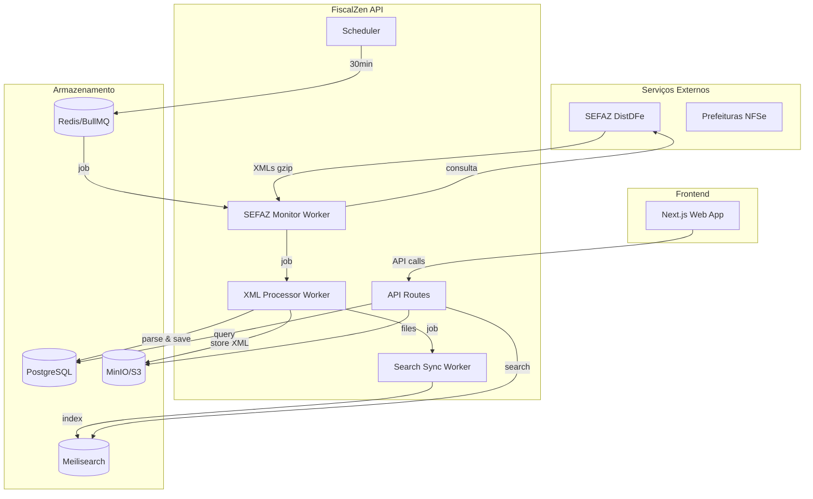
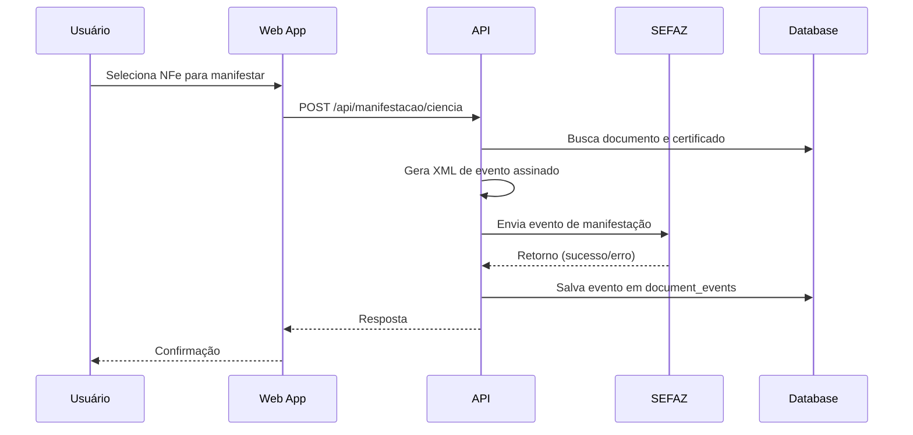
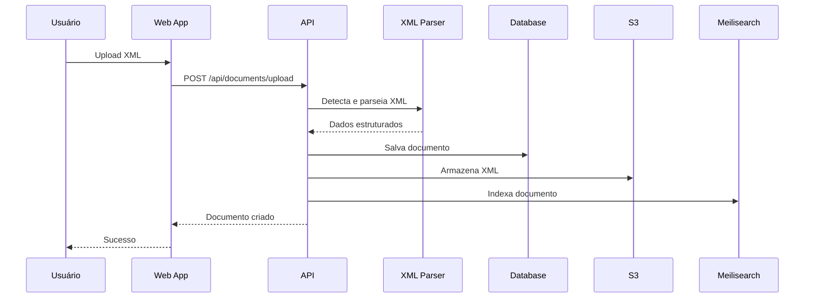

# Data Flow & Integrations

Como os dados entram, fluem e saem do sistema FiscalZen.

## High-level Flow



## Fluxo Principal: Sincronização SEFAZ

### 1. Scheduler Trigger
```
[Scheduler] --cada 30min--> [Redis Queue: sefaz-monitor]
```

O scheduler ([scheduler.ts](apps/api/src/jobs/scheduler.ts)) consulta a tabela `nsu_control` para encontrar empresas que precisam de sincronização:

```sql
SELECT company_id, doc_type, tenant_id
FROM nsu_control
JOIN companies ON companies.id = nsu_control.company_id
WHERE companies.ativo = true
  AND companies.certificate IS NOT NULL
  AND companies.certificate_expiry > NOW()
  AND (next_sync IS NULL OR next_sync <= NOW())
  AND sync_status NOT IN ('syncing', 'rate_limited')
```

### 2. SEFAZ Monitor Worker
```
[Redis Queue] --> [SEFAZ Monitor Worker] --> [SEFAZ DistDFe]
```

O worker ([sefaz-monitor.ts](apps/api/src/jobs/sefaz-monitor.ts)):
1. Carrega certificado da empresa (descriptografa)
2. Consulta SEFAZ DistDFe com último NSU
3. Recebe XMLs compactados (GZIP + Base64)
4. Para cada documento, cria job no `xml-processor`
5. Atualiza `nsu_control` com novo último NSU

### 3. XML Processor Worker
```
[Redis Queue] --> [XML Processor] --> [PostgreSQL + S3]
```

O worker ([xml-processor.ts](apps/api/src/jobs/xml-processor.ts)):
1. Decodifica e descompacta XML
2. Detecta tipo de documento (NFe, CTe, MDFe, Evento)
3. Parseia usando `@fiscalzen/xml-parser`
4. Salva no PostgreSQL (tabela `documents` ou `document_events`)
5. Armazena XML original no S3
6. Cria job no `search-sync`

### 4. Search Sync Worker
```
[Redis Queue] --> [Search Sync] --> [Meilisearch]
```

O worker ([search-sync.ts](apps/api/src/jobs/search-sync.ts)):
1. Carrega documento do PostgreSQL
2. Prepara registro para indexação
3. Envia para Meilisearch

## Fluxo: Manifestação do Destinatário



## Fluxo: Upload de Documento Manual



## External Integrations

### SEFAZ Web Services

| Serviço | Endpoint | Propósito |
|---------|----------|-----------|
| NFeDistribuicaoDFe | AN (Ambiente Nacional) | Consultar NFe destinadas |
| CTeDistribuicaoDFe | SVRS | Consultar CTe destinados |
| MDFeDistribuicaoDFe | SVRS | Consultar MDFe |
| RecepcaoEvento | UF do emitente | Enviar manifestação |

**Autenticação**: Certificado digital A1 (mTLS)

**Payload**: SOAP/XML com envelope padrão SEFAZ

**Retry Strategy**:
- Timeout: 30 segundos
- Retries: 3 tentativas com backoff exponencial
- Rate limit: Respeita código 656 (consumo indevido)

### Prefeituras (NFSe)

| Integração | Método | Municípios |
|------------|--------|------------|
| ABRASF WebService | SOAP/XML | São Paulo, Rio, BH, etc. |
| RPA (Playwright) | Scraping | Municípios sem WS |

**Autenticação**: Certificado A1 ou login/senha (RPA)

## Internal Communication

### BullMQ Queues

| Queue | Producer | Consumer | Payload |
|-------|----------|----------|---------|
| `sefaz-monitor` | Scheduler, API | sefaz-monitor worker | `{companyId, tenantId, docType}` |
| `xml-processor` | sefaz-monitor | xml-processor worker | `{companyId, tenantId, nsu, xmlContent, docType}` |
| `search-sync` | xml-processor, API | search-sync worker | `{documentId, tenantId, action}` |
| `nfse-monitor` | Scheduler | nfse-monitor worker | `{companyId, configId}` |

### Event Flow

```typescript
// Job lifecycle events
type JobEvent = {
  type: 'started' | 'completed' | 'failed' | 'progress';
  queue: string;
  jobId: string;
  data?: any;
  error?: string;
};
```

## Data Stores

### PostgreSQL Tables

| Tabela | Propósito | Relacionamentos |
|--------|-----------|-----------------|
| `tenants` | Organizações | - |
| `companies` | Empresas | → tenants |
| `documents` | Documentos fiscais | → companies, tenants |
| `document_events` | Eventos de documentos | → documents |
| `nsu_control` | Estado de sincronização | → companies |
| `nfse_configs` | Configurações NFSe | → companies |
| `audit_logs` | Auditoria | → tenants |

### Redis Keys

| Pattern | Propósito | TTL |
|---------|-----------|-----|
| `bull:sefaz-monitor:*` | Jobs de sync SEFAZ | Até processamento |
| `bull:xml-processor:*` | Jobs de parsing | Até processamento |
| `rate-limit:*` | Contadores de rate limit | 1 minuto |
| `session:*` | Sessões (se aplicável) | Configurável |

### Meilisearch Indexes

| Index | Campos Pesquisáveis | Filtráveis |
|-------|---------------------|------------|
| `documents` | chave, numero, emitRazaoSocial, destRazaoSocial, natOp | tenantId, companyId, docType, situacao, dataEmissao |

### S3 Buckets

| Bucket | Conteúdo | Estrutura |
|--------|----------|-----------|
| `fiscalzen-docs` | XMLs originais | `{tenantId}/{companyId}/{docType}/{chave}.xml` |

## Observability

### Logs

```typescript
// Structured logging com pino
logger.info({
  queue: 'sefaz-monitor',
  companyId,
  nsu: lastNsu,
  documentsFound: docs.length
}, 'SEFAZ sync completed');
```

### Metrics (Planejado)

| Métrica | Tipo | Descrição |
|---------|------|-----------|
| `sefaz_sync_duration_seconds` | Histogram | Tempo de sincronização |
| `documents_processed_total` | Counter | Documentos processados |
| `queue_depth` | Gauge | Tamanho das filas |

### Failure Modes

| Falha | Detecção | Ação |
|-------|----------|------|
| SEFAZ timeout | Erro no worker | Retry com backoff |
| Rate limit (656) | Código de retorno | Marca `rate_limited`, aguarda |
| Certificado expirado | Verificação pré-sync | Notifica usuário |
| XML inválido | Erro de parsing | Log, pula documento |
| Meilisearch down | Erro de conexão | Retry, fila de fallback |
